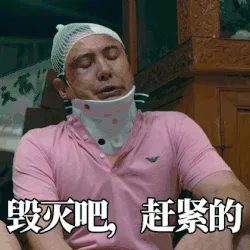

+++
title = '喜提斯特拉93'
date = 2024-10-13T19:10:24+08:00
draft = false
tags = ['sports']
categories = ['cycle']
+++

# 1. 喜提新车

早上先去店里吃了豆腐脑、油条、4 块钱的酱香饼，总共花了 9.5 元。然后坐了地铁去沈杜公路，去了美利达自行车店才发现老板营业时间在 9:30~20:30，于是我骑美团单车在附近遛了半个多小时，中间看到一处很美的小区：水月锦绣苑，里面装修很新，但是也发现了几个问题：

1. 附近很偏，几乎没什么广场，还有一块闲置的地皮；
2. 里面的好几户人家都在装修，如果住进入感觉会很吵；

不过好在是距离下次租房子还有好几个月，于是这件事情就先不急。或许这也是骑行的一个乐趣吧，总能在路上看到一些好玩的，能发现周边的住房、美食广场等等。

之后就是到老板店里去购车。和老板讨论了一会儿：斯特拉 King、斯特拉 93、斯特拉 95、斯特拉 95d。这几款车型都差不多，主要是配件的不同。我比较中意 King 和 93。由于 King 的定价在 5798，里面包含了价值 1000 元的配件（头盔、前灯、码表等），但是大头头盔我已经有了，此外配送的那些东西淘宝上面不过几百块钱，我认为不太值；此外，后面的车子不骑了还可以二手卖给老板，所以我决定先买个 93 试试水。

买完车之后先试骑了下，完全和山地车不同，一上车差点直接摔地下，它要求人的平衡太重了，不过骑了一会慢慢的适应了，后面就先骑回家了。

# 2. 上午小试牛刀

早上骑的基本上都是公路，因此配速相对快一些。

# 3. 下午随便骑骑

下上骑的路比较烂，所以整体配速不是很快。不过中间到郊野公园转了转，看到了成群结队的摩友以及闵浦大桥。这两次骑行都不怎么累，一路上不是红绿灯，就是各种麻烦的路况，因此，都是骑骑停停的。

不过下午骑行的时候发现有些东西在没有的时候非常想要得到它，但是一旦获得了就会变得毫不在意。在购买完新车后内心并没有很大的喜悦。还有之前心心念念的油泼面，今天下午去吃了，寻思着很久没吃了，再加上非常想吃，于是点了个加量的，很意外的竟然没有吃完，而且迟到一半就已经腻了，后面还是强撑着又吃了 1/4。此外看到路上行人都是结伴而行，孤独感油然而生，现在非常理解王维的“独在异乡为异客”的感觉了。

我发现很多事情并不能激发我的多巴胺分泌了，对于很多事情感觉都是很平淡的，难道这就是所谓的生理年龄 24，心理年龄 70 嘛？

<!--  -->

  

