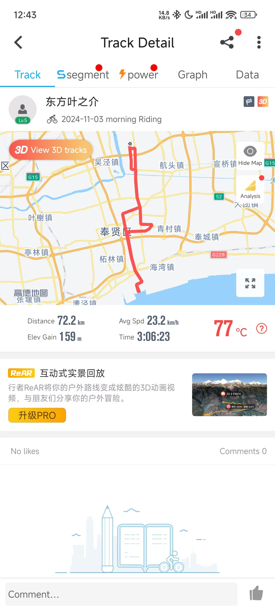
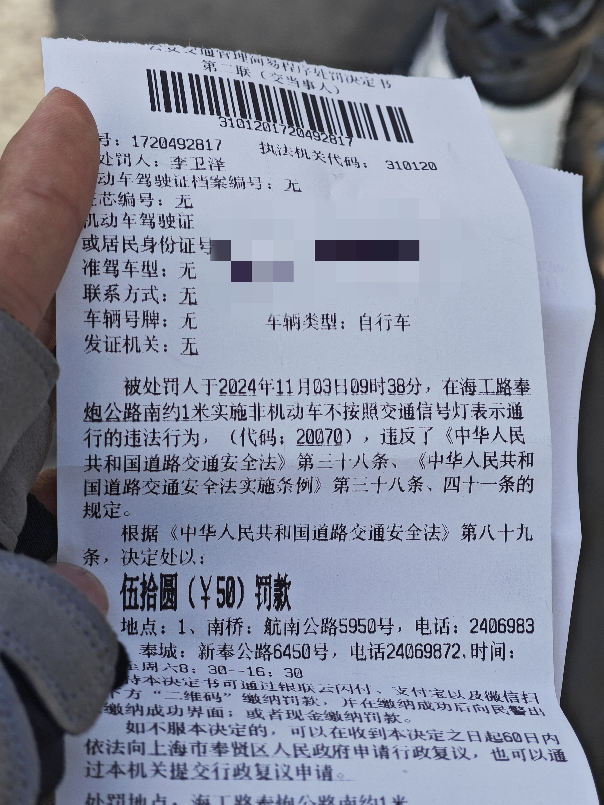
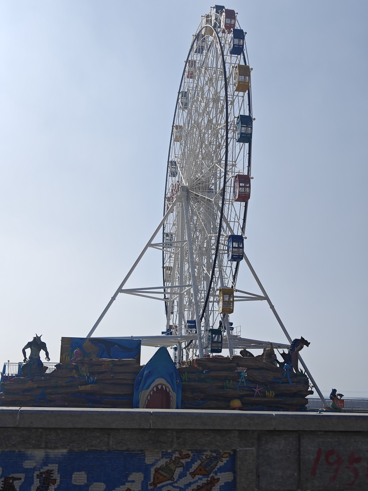

+++
title = '第一张自行车罚单'
date = 2024-11-03T20:30:06+08:00
draft = false
tags = ['sports']
categories = ['cycle']
+++

昨天得知一个朋友说第二天早上有个骑行的团，我寻思着他们七点出发，我七点半出发看能不能赶上他么，结果骑到渔人码头后发现没啥骑友，于是待了一会就巡回了。结果，好死不死，中间闯个红绿灯给交警逮了，罚了50。哎，今天真是不宜出行啊！
<!--  -->

  

  

  

  

