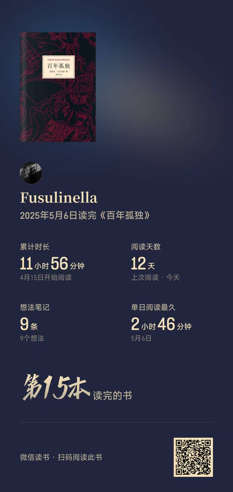
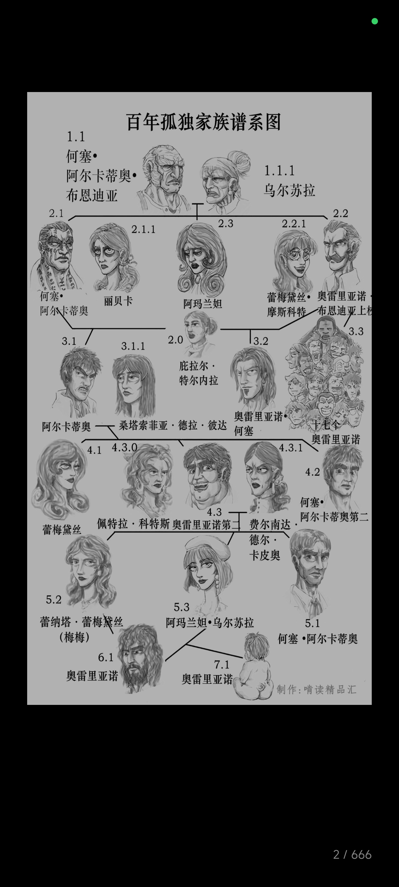

# 百年孤独

这本书算是一类超魔幻现实主义的书种。马孔多小镇算是拉丁美洲的一个缩影吧。何塞·阿尔卡蒂奥·布恩迪亚家族做为马孔多小镇的创世一族，曾带领这个小镇走向繁荣，积极接受外部先进的开放文明，使得这个小镇从一个较为原始的村庄变成一个比较现代化的村庄，再到这个小镇被侵略者吃干抹净之后变成一个更加落寞的城市，或许，当年较发达资本主义国家就是这样起家的吧，掠夺完这个比较落后国家的资源后，把基建设施撤走，导致这些地方更加贫穷，或许这就是历史发展的必然进程吧！

书中所有的人都是孤独的。老何赛如此，乌尔苏拉亦如此，所有人都是如此，内心的孤独永远无法真正的同他人诉说，书中所有人都是孤独的个体。所以马尔克斯传达出来的观点是什么呢？

看完之后感觉好震撼，百年的历史我竟然在试十几个小时内读完了，每个人物波澜壮阔的一生仿佛顷刻之间就跃然纸上，突然发现生命真的转瞬即逝，我们这一生可能在死后只有寥寥几笔~

  

  

