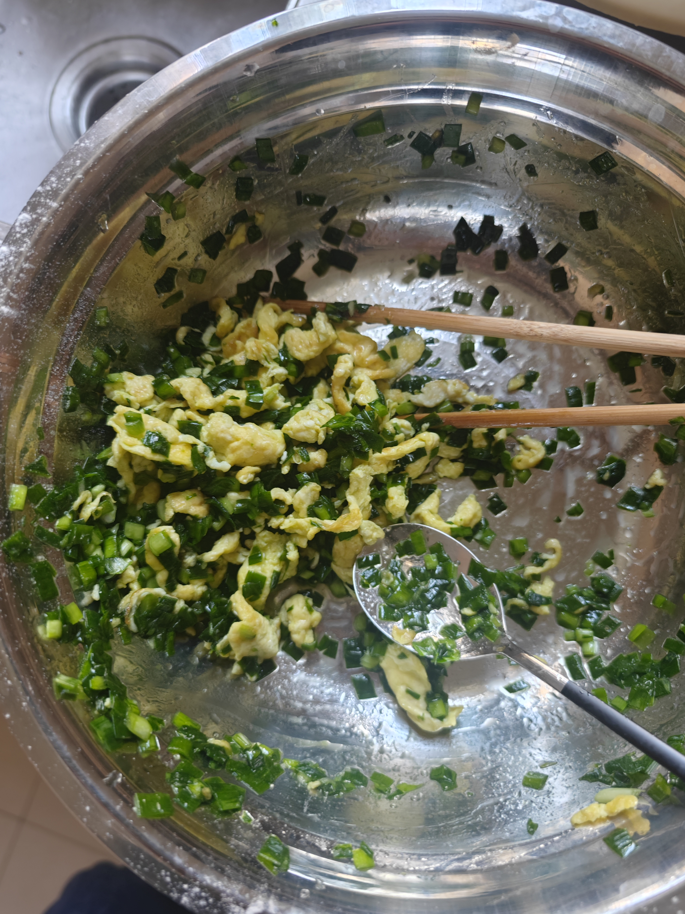
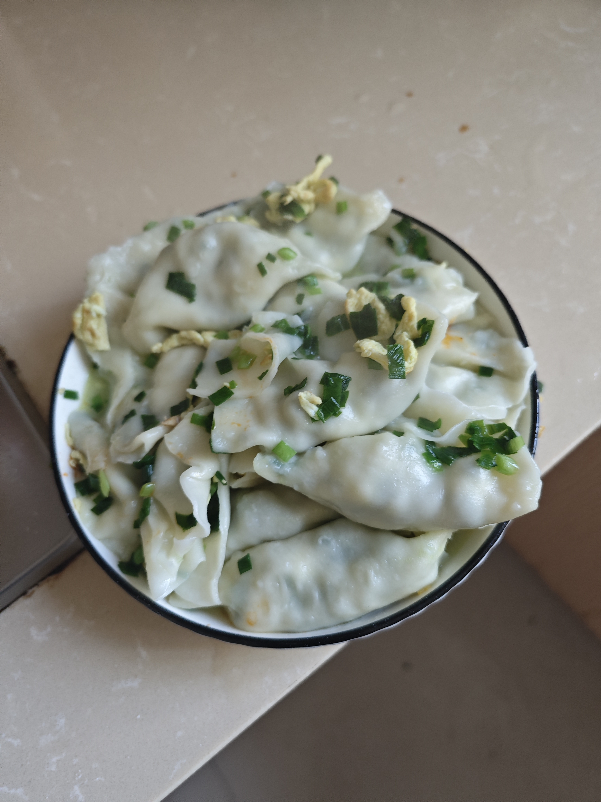
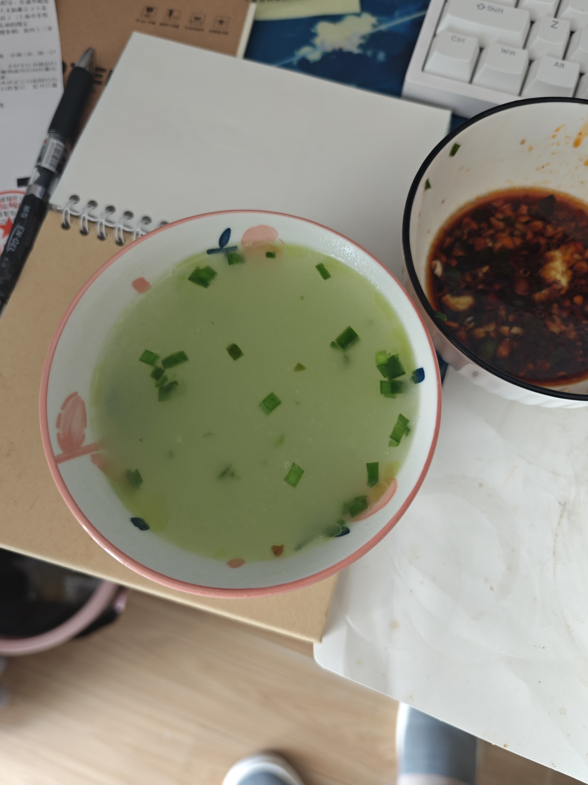
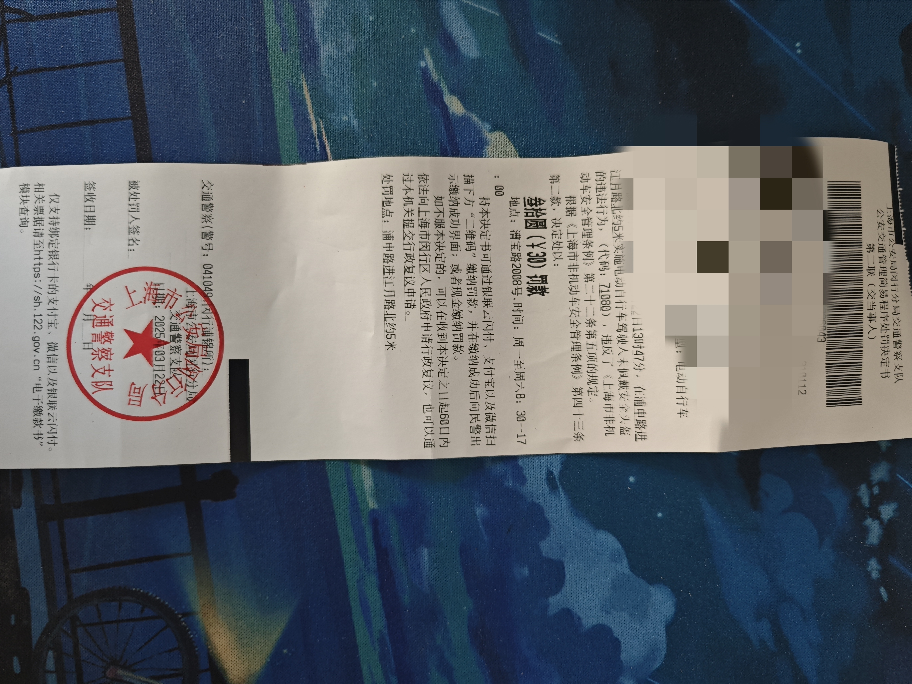

# 3.22-3.23周末见闻

# 首次包韭菜鸡蛋馅饺子
昨天和同事吃了韭菜鸡蛋饺子，觉得挺好吃的，想着今天做一顿来吃吃看。然后就开始和馅，饺子皮超市买的现成的。开始之前，现在 b 站找几个比较火的视频，临时抱佛脚一下。
	
我采用的是比较简单的做法。韭菜首先往案板上蹲一下，去除根部; 接着将韭菜切成小段，放入盘中备用。之后就是炒鸡蛋，现在用的是用筷子在炒的时候搅碎，感觉这个方法不太行，弄出来的鸡蛋块比较大，导致后面包饺子的时候不太好包。然后韭菜里面放入适量的花生油，搅拌均匀后，放入鸡蛋，再放入食用盐，之后不需要放其他调味剂了，到此为止，馅就制作完成了。
	
然后包了八个之后，一看该到游泳课的时间了，我就暂时搁置了，游完泳之后发现油开始沥出来了，后面包的饺子就比较失败了。
	
煮出来的饺子一点色相都没有，只能说能吃，哎，好失败啊。
	
接下来总结一下:
1. 鸡蛋可以炒好之后放在案板上切碎；
2. 盐不要放太多，先放一点，尝尝咸淡，如果觉得淡了再放盐，切忌一次性放太多；
3. 韭菜多来点，不然导致鸡蛋太多了，吃起来没有韭菜的原味了；
4. 最好一次性包完。
	
由于是第一次包饺子，所以煮出来的成品比较失败，就没放煮好后的图片，看看这面汤就知道煮出来的饺子多失败了，不过这饺子汤倒是挺好喝的，哈哈。

  

  

  

  

  

# 游泳第三节课
今天 🏊 上到了第三节课，腿部动作基本学的差不多了，估计下节课就可以学习换气了。这次是左脚没有往外翻，还有就是在并脚的过程中脚一定要勾紧。

# 未戴头盔罚款
这已经是第二吃在上海被罚款了，上一次是骑🚴闯红灯被罚款 50 元，这次是未戴🪖被罚款 30 元，当时好多人都没戴🪖，就罚了几个人，而我就是其中之一，这运气也是没谁了。哎，我当机立断，下单了个🪖。岂可修！

我发现要在上海要锻炼出在不显眼的位置识别交警的能力，不然，可有的罚款了。

  

# 下午骑行空山基
下午天气还不错，加之之前群里看到有人发空山基的图片，我寻思去转一遭。路上的骑友好多，可能天气比较好的缘故，女骑友也是异常的多，光我看到的就有三个，而且🧑‍🤝‍🧑一起骑车的也很多，突然有些羡慕，我也想找一个可以一起骑行的女朋友。嘤嘤嘤～

浦东南路不好骑行。道路窄、没骑行道、人多、路不平、车多。

  

  

  

  

  

  

# 品尝🍷
今天买的`梅洛干红`红酒到了。味道嘛，还可以接受，就是有一点点酸，但是跟阔乐比起来还是差很多的，我不知道为啥很多人都说🍷这么好喝，really？

  

# 周日赏梅
早上起来都已经 10 点多了，去超市买完菜之后都已经 12 点多了，原本打算和同事去鲁迅公园去玩的，但是他嫌太远了，于是我就坐门口的公交车去莘庄梅园去玩了。来回坐公交都是一个小时左右。今天坐公交的人大都是老太太，而且人不多，所以都是坐着的。

到了地方之后先吃了兰州牛肉拉面里面的蛋炒饭 + 🧊阔乐，总共 17，但是炒饭只要 13，我怀疑阔乐卖贵了，下次遇到这种情况一定要说去来，阔乐 4 块一瓶吗？

这个梅园还挺大的，里面分为两个区域，每个区域都有很多人在露营，搭帐篷。不得不说，里面的梅花是真的漂亮，有美景，无佳人啊。天气非常晒，并且没有涂🧴，于是，走了一个小时左右我就回去了。

到家之后，立即去超市买了一个🍦和一瓶无糖阔乐。想想人生真是舒服呢，这种情况下就会感慨单身是多么的自由啊，想买啥买啥，完全不用考虑另一半的想法。

  

  

  

  

# 无缘🏃
想着半个月没跑步了，膝盖应该缓的差不多了，就想去🏃。结果，跑了一公里，膝盖就发出了终止的号令，得，玩完，只能再等一个月看看了。不会这一辈子都不能🏃了吧，想想好痛苦呢～

