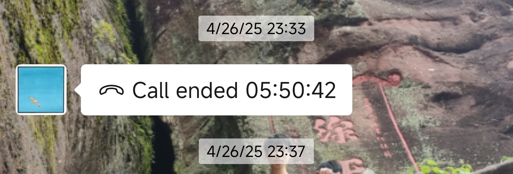

# 04-26-复盘

目前自我感觉越来越浮躁了，这可不是什么好兆头，怀疑是短视频看的越来越多了，昨晚在打游戏的时候等待期间进入小红书，发现好多帖子都是很弱智的言论，以及很多帖子都是引流的，这些帖子刷多了感觉自己不知不觉就深受这些言论的影响，进而变得越来越消极，能量越来越低。

还有一件事情是我发现和一位同事聊天的时候自己变得越来越。。。不知道用什么词形容了，就是这位 00 后很杠，你说一句话他就习惯性的跟你杠，说几句话之后感觉自己脾气就上来了，情绪就很负面，和其他同事交流完全没有这个问题。我想这就是典型的气场不和，但是又不能不交流，毕竟需要经常对接，有时还需要出去吃饭，幸亏自己大部分时间自己带饭，和他们出去吃饭的次数有限。人生就是一场修行，未来免不了和各式各样的人打交道，所以，我能做的就是改变自己。

自己还算是比较幸运的，虽然不知道是通过什么契机发现这些点的，可能是偶然所得，但是既然发现了，我想这就是偶然所得的财富吧。那么我能做的就是

1. 毕竟自己身处简中圈，不知不觉中总会刷到一些帖子，最简单粗暴的方式就是卸掉小红书或者相关的 APP，这些东西真的和自己关系很大吗，就算不了解这些热点新闻又有什么关系呢，如果一件事情真的很火热的话总会有人告诉你的。被动摄入和主动吸收二者区别是很大的。理论很早之前就知道，但是真正做到主动吸收还是很困难的。目前，还是暂时保留这些 APP，如果后续还是难以控制的话，直接卸载，要看的话直接在网页端看。
2. 对于同事这件事能做的就是要么少聊天，要么聊到某一个话题觉得不舒服直接换另外一个话题。

写这篇文章的时候注意力就很不集中，写到一半的时候直接开始看手机了，思路也被打断了，后面再继续写的时候思绪已经发生变化了，如此不好不好~

追加：周六晚上和朋友聊天，我发现我还是更喜欢高层次的聊天。

  

